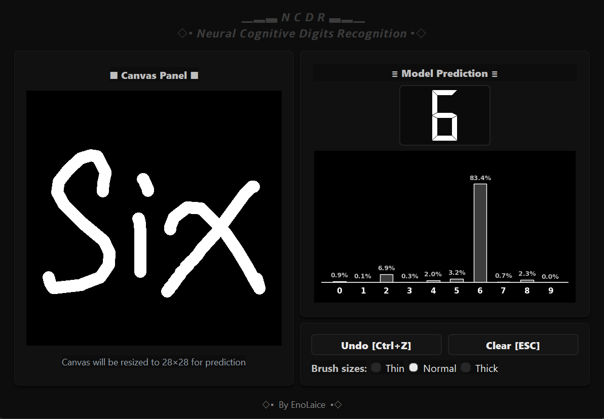
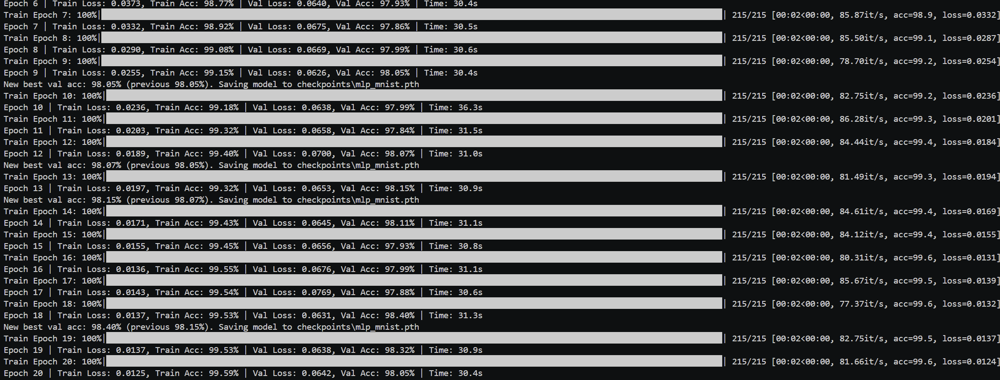
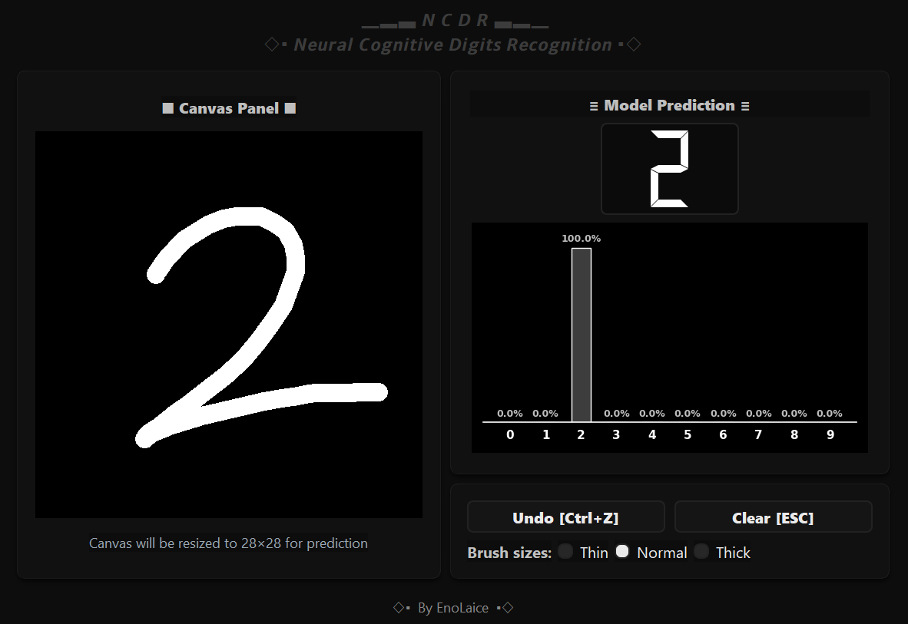

# NCDR

  

  

### Neural Cognitive Digits Recognition – Handwritten Digit Classifier using PyTorch
A modular project for recognizing handwritten digits (MNIST dataset) with PyTorch. 
Supports both training a neural network model and running an interactive GUI app for digit recognition. 
## Features 
- Modular PyTorch implementation with **MLP (Fully Connected Network)**.
- Separate scripts for **training** and **inference**.
- Interactive GUI for drawing digits and predicting them in real-time.
  
## Train model

## Run app

